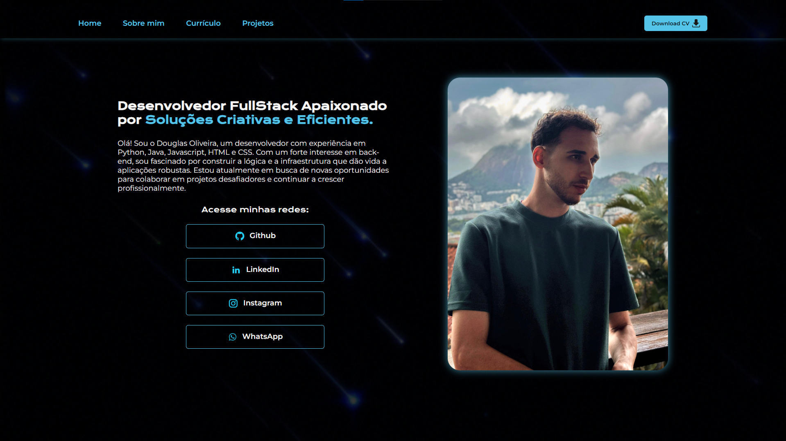

# 🌟 Portfólio Pessoal - Douglas Oliveira

Bem-vindo ao meu portfólio pessoal! Este projeto apresenta minha jornada como desenvolvedor FullStack, destacando minhas habilidades, projetos e experiências profissionais.

## 📸 Prévia do Projeto

# 

## 🚀 Sobre o Projeto

Este portfólio foi desenvolvido como uma vitrine digital das minhas competências técnicas e projetos realizados. O site apresenta uma interface moderna e responsiva, com animações suaves e um design profissional que reflete minha paixão por desenvolvimento web.

### ✨ Funcionalidades

- **Design Responsivo**: Adaptável a diferentes tamanhos de tela
- **Navegação Intuitiva**: Menu de navegação fluido entre as seções
- **Carrossel Interativo**: Exibição dinâmica de projetos e certificados
- **Animações CSS**: Efeitos visuais modernos e profissionais
- **Download de CV**: Acesso direto ao currículo em PDF
- **Links para Redes Sociais**: Conexão direta com perfis profissionais

### 📱 Seções do Site

1. **Home**: Apresentação pessoal e links para redes sociais
2. **Sobre Mim**: História pessoal e trajetória na tecnologia
3. **Currículo**: Tecnologias, certificações e experiências profissionais
4. **Projetos**: Showcase dos principais projetos desenvolvidos

## 🛠️ Tecnologias Utilizadas

### Frontend

- **HTML5**: Estruturação semântica do conteúdo
- **CSS3**: Estilização avançada com Flexbox e animações
- **JavaScript**: Interatividade e funcionalidades dinâmicas

### Bibliotecas e Frameworks

- **Slick Carousel**: Carrossel responsivo para projetos e certificados
- **jQuery**: Manipulação DOM e eventos
- **Google Fonts**: Tipografia personalizada (Krona One, Montserrat)

### Ferramentas de Desenvolvimento

- **Git & GitHub**: Controle de versão e hospedagem do código
- **Vercel**: Deploy e hospedagem dos projetos

## 🎨 Design e UX

- **Paleta de Cores**: Esquema moderno com azul (#55C4E9) como cor principal
- **Tipografia**: Combinação harmoniosa entre Krona One e Montserrat
- **Layout**: Design limpo e profissional com foco na experiência do usuário
- **Animações**: Transições suaves e efeitos hover para melhor interatividade

## 📂 Estrutura do Projeto

```
Portfolio/
├── index.html          # Página principal
├── about.html          # Página sobre mim
├── curriculo.html      # Página de currículo
├── projects.html       # Página de projetos
├── styles/
│   └── style.css       # Estilos principais
├── assets/
│   ├── *.png           # Imagens e ícones
│   ├── *.jpg           # Fotografias
│   ├── *.gif           # Animações
│   └── *.pdf           # Currículo em PDF
└── README.md           # Documentação do projeto
```

## 🌐 Deploy

O projeto está hospedado e pode ser acessado através do GitHub Pages ou Vercel. Todos os projetos mencionados no portfólio também possuem links diretos para suas respectivas demonstrações online.

- Portfólio online: [https://portfolio-sage-sigma-63.vercel.app/](https://portfolio-sage-sigma-63.vercel.app/)

## 📈 Projetos em Destaque

- **Jogo do Número Secreto**: Jogo interativo desenvolvido em JavaScript
- **Quiz do Amor**: Aplicação personalizada com sistema de pontuação
- **Amigo Secreto**: Sistema de sorteio com interface intuitiva

## 🎯 Objetivos do Projeto

Este portfólio foi desenvolvido com os seguintes objetivos:

- Demonstrar competências técnicas em desenvolvimento web
- Apresentar projetos de forma profissional e organizada
- Facilitar o contato com recrutadores e potenciais empregadores
- Servir como referência da evolução profissional

## 📞 Contato

**Douglas Oliveira**  
Desenvolvedor FullStack

[](https://www.linkedin.com/in/douglas-oliveira-627088188/)
[](https://github.com/notdougz)
[](https://www.instagram.com/d.oliveira._/)
[](https://wa.me/5511962778904)

---

⭐ **Se você gostou do projeto, não esqueça de dar uma estrela no repositório!**

_Desenvolvido por Douglas Oliveira_
